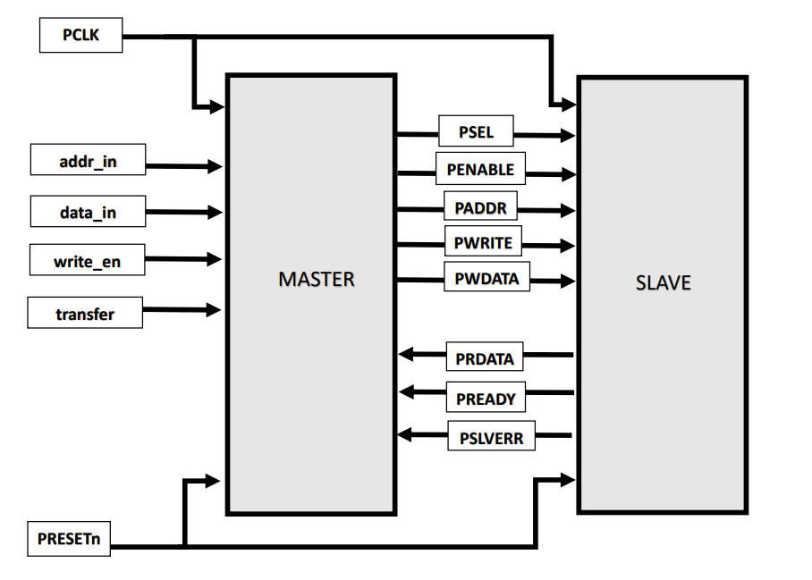
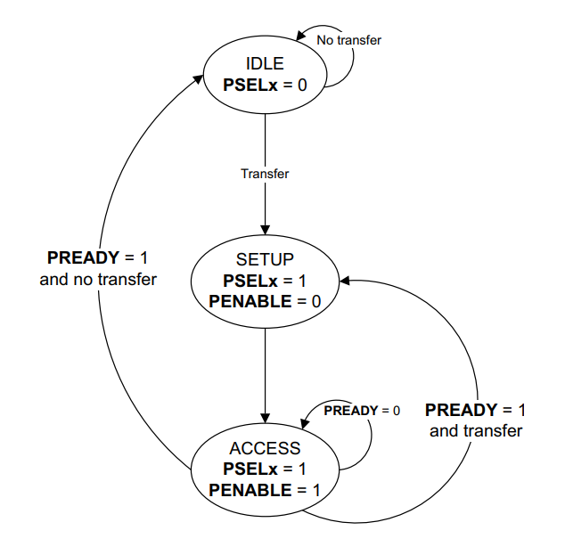

# APB Protocol Verification

## 1. Introduction

The **Advanced Peripheral Bus (APB)** is part of the AMBA (Advanced Microcontroller Bus Architecture) hierarchy. It is optimized for minimal power consumption and reduced interface complexity. Unlike high-performance buses like AXI or AHB, APB is non-pipelined and is primarily used to connect the main system bus to low-bandwidth peripherals such as UART, SPI, I2C, and Timers.

## Key Features

* **Low Complexity:** Simple interface with a minimal signal count.
* **Non-Pipelined:** Every transfer takes at least two clock cycles (Setup and Access).
* **Single Master:** Typically driven by an APB Bridge which acts as the master.
* **Synchronous:** All signal transitions are related to the rising edge of `PCLK`.
* **Error Signaling:** Includes `PSLVERR` to indicate failed transactions.

## Signal Description

| Signal | Direction | Description |
| :---: | :---: | :---: |
|**PCLK**	    |`System`	                |Bus clock. All transfers are timed relative to the rising edge.|
|**PRESETn**	|`System`	                |Active-low system reset.|
|**PADDR**	    |`Master -> Slave`	        |Address bus (typically up to 32 bits).|
|**PSELx**	    |`Master -> Slave`	        |Select signal for a specific subordinate (x).|
|**PENABLE**	|`Master -> Slave`          |Indicates the second and subsequent cycles of an APB transfer.|
|**PWRITE**	    |`Master -> Slave`	        |Direction signal (High = Write, Low = Read).|
|**PWDATA**  	|`Master -> Slave`          |Write data bus (driven during write cycles).|
|**PREADY** 	|`Slave -> Master`          |Used by the subordinate to extend a transfer (Wait states).|
|**PRDATA**     |`Slave -> Master`	        |Read data bus (driven during read cycles).|
|**PSLVERR**	|`Slave -> Master`          |Error signal indicating a failed transfer.|

---

## Block Diagram

---

## State Diagram

**APB FSM** 

The APB operation is governed by a simple 3-state Finite State Machine (FSM). Understanding these transitions is critical for writing accurate **SystemVerilog Assertions**.

* **IDLE:** The default state. `PSEL` and `PENABLE` are low.
* **SETUP:** Triggered when a transfer is required. `PSEL` is asserted. This state always lasts exactly one clock cycle.
* **ACCESS:** `PENABLE` is asserted. The address, write, and select signals must remain stable. If the slave asserts `PREADY`, the FSM returns to `IDLE` (or moves to `SETUP` for a new `transfer`). If `PREADY` is low, it remains in `ACCESS`.

---

## Test Sequences & Stimulus Strategy

The APB verification environment utilizes a variety of sequences to stress-test the protocol's non-pipelined nature and ensure data integrity in the peripheral memory.

 **1. apb_write_read_seq (Atomic Data Integrity)**

* **Objective:** To verify that data written to a specific address can be accurately retrieved.

* **Scenario:** Performs 20 iterations of a Write transaction followed immediately by a Read transaction to the same address using the constraint {addr == w_tr.addr;}.

* **Verification Goal:** Validates the basic connectivity and the read/write logic of the peripheral registers.

**2. apb_memory_stress_seq (Full Burst Stress)**

* **Objective:** To ensure the memory array can handle continuous loading and unloading without data corruption.

* **Scenario:** A two-phase test. First, it populates the entire address space (16 locations) with unique $urandom data. Second, it performs a full sweep of reads to verify the contents.

* **Verification Goal:** Exercises address decoding logic and checks for memory "leakage" or incorrect indexing.

**3. apb_b2b_seq (Throughput & Timing Stress)**

* **Objective:** To verify the FSM's ability to transition directly from the **ACCESS** state of one transaction to the **SETUP** state of the next.

* **Scenario:** Drives 5 consecutive transfers with delay == 0.

* **Verification Goal:** This is a critical timing test. It ensures the master does not drop `PSEL` unnecessarily between transfers and that the slave can keep up with maximum bus throughput.

**4. apb_error_injection_seq (Robustness & Slave Error)**

* **Objective:** To verify the slave's error-reporting mechanism (`PSLVERR`).

* **Scenario:** Intentionally disables address constraints to drive an "Out-of-Bounds" address (32'h0000_0100).

* **Verification Goal:** Confirms that the peripheral correctly identifies invalid access attempts and asserts the error signal instead of hanging the bus.

**5. apb_reset_chk_seq (System Resilience)**

* **Objective:** To ensure the bus settles to a safe state during and after a reset event.

* **Scenario:** Writes a "golden value" (`32'hAAAA_BBBB`) to memory and monitors the interface while a reset is triggered.

* **Verification Goal:** Proves that all control signals (`PSEL`, `PENABLE`) return to zero and that the memory either holds data or clears based on the design spec, without causing bus contention.

---

## System Verilog Assertions(SVA)

To ensure the APB protocol's rigid timing requirements are met, I implemented a dual-check strategy using SystemVerilog Assertions. This validates both the Master's driving logic and the Slave's response behavior.

**Master Protocol Validation**

* **FSM Phase Compliance:** `a_mstr_psel_start` and `a_penable_logic` verify that the Master correctly follows the ``IDLE -> SETUP -> ACCESS`` state transitions. Specifically, it ensures `PENABLE` is never asserted in the same cycle as `PSEL`.
* **Signal Stability:** During the `ACCESS` phase, if the Slave is not ready (`!PREADY`), the Master is forbidden from changing the address or data. The `p_signals_stable` property ensures `PADDR`, `PWRITE`, and `PWDATA` remain constant, preventing glitches.
* **X-Checking:** Formal checks verify that no unknown ('`X`') values are driven on `PADDR` or `PWDATA` during active transactions.

**Slave Protocol Validation**

* **Response Integrity:** `a_slave_idle_check` ensures that if the Slave is not selected (`!PSEL`), it must not drive `PREADY` or `PSLVERR`. This prevents multiple peripherals from contending for the bus.

* **Error Reporting:** The `p_slave_error_check` formally verifies the decoding logic, asserting that `PSLVERR` is triggered if the address falls outside the valid peripheral range.

* **Liveness:** `assert_slave_finish` uses the `s_eventually` operator to guarantee that a transaction will eventually complete, ensuring the Slave cannot hang the system bus indefinitely.

## Functional Coverage 

The Functional Coverage model is designed to prove that the verification environment has explored all critical legal and illegal corners of the APB address space and control signals.

**Coverpoints**

* **Address Range (cp_addr):** Segregated into `low`, `mid`, and `high` ranges to ensure the decoding logic is tested across the entire valid memory map.

* **Transfer Type (cp_wr_en):** Tracks the distribution of Read vs. Write operations.

* **Error Detection (cp_slverr):** Specifically monitors if the testbench successfully triggered and observed a PSLVERR event.

* **Reset Coverage (cp_rst):** Ensures that the design was verified under both active-low reset and normal operational states.

**Cross Coverage**

* **cross_addr_wr:** Crosses the address ranges with the write enable signal.

* **Illegal Bin Management:** I implemented `ignore_bins` for illegal writes to out-of-range addresses. This ensures our coverage percentage is an accurate reflection of *valid* functional space while relying on SVA to catch the illegal access attempts.

---
## Waveforms

for waveform please look in the result folder, there you can find the waveforms for each test i have done.

## Tools Used

* **Language:** SystemVerilog, UVM
* **Simulator:** Aldec Riviera Pro 2025.04 / EDA Playground
* **Methodology:** Constrained Random Verification (CRV), Assertion Based Verification (ABV), Coverage Driven Verification (CDV)

## Technical Insight for Recruiters

In this APB verification project, I developed a robust UVM environment focused on protocol compliance and edge-case resilience. I implemented a modular SVA suite to strictly enforce timing requirements, such as signal stability during slave wait-states and the single-cycle SETUP phase transition. By utilizing constrained random sequences, I stressed the bus with back-to-back transfers and injected "out-of-bounds" addresses to validate the PSLVERR response. This approach, combined with cross-coverage and illegal bin analysis, ensured that the design handles peak throughput efficiently while remaining immune to system hangs or data corruption during illegal access attempts.

