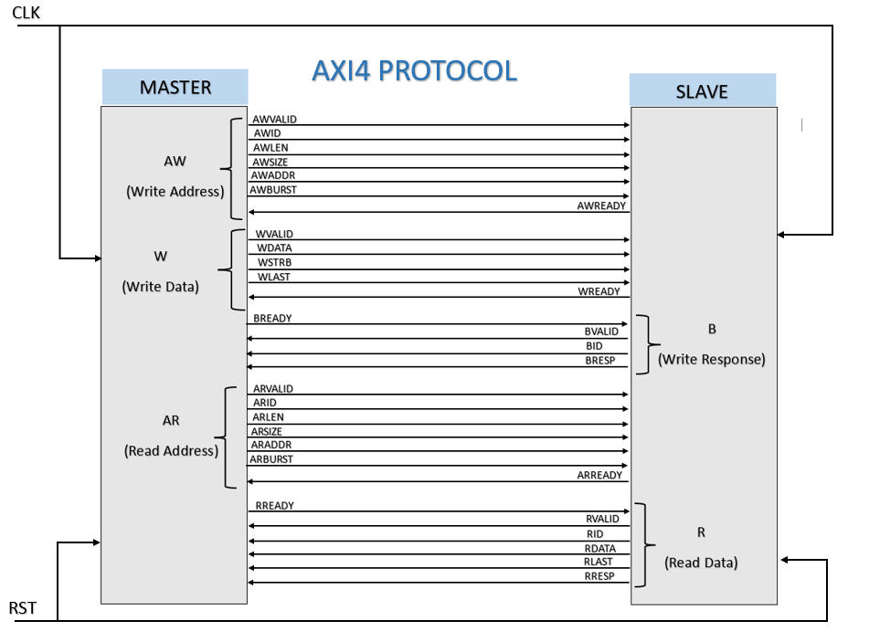

# AXI4 Full Slave Memory IP & UVM Verification Environment

## Project Overview

This repository contains a production-grade **UVM (Universal Verification Methodology)** environment for verifying a synthesizable **AXI4 Full Slave Memory IP** core implemented in SystemVerilog.

The design features support for complex **AMBA AXI4 protocol** features, including multi-beat burst transfers, dynamic data masking, and error subsystem tracking. The verification platform leverages an automated inline**SystemVerilog Assertion (SVA)** structural checker suite, a comprehensive functional coverage collection engine, and a targeted sequence suite built to handle high-stress pipelining and out-of-bounds validation.

---

## Design Specifications

***Core Features***

* **Fully Synchronous BRAM Inference:** Core memory is structured into discrete structural arrays (`mem_lane`) to guarantee direct physical block RAM mapping without initialization or simulation garbage states ('`hxx`).

* **In-Order Transaction Processing:** This IP is strictly an **In-Order Slave**. It does not support Out-of-Order (OOO) execution or interleaved data responses. While it accepts multi-ID traffic on its address channels, it processes and responds to transactions in the exact order they were received, eliminating the need for heavy area-intensive reordering buffers.

* **AXI4 Burst Type Support:**

* * **FIXED (2'b00):** For FIFO or non-incrementing address mapping.
* * **INCR (2'b01):** For linear consecutive memory addresses.
* * **WRAP (2'b10):** Dynamic calculation of cache-line modulo roll-overs across standard boundary lengths.

* **Dynamic Data Masking:** Full support for byte-lane write strobes (`wstrb`) to allow narrow individual byte overwrites while preserving untouched ambient memory bytes.

* **Error Subsystem Tracking:** Monitors memory boundaries against a parameterized static threshold (`MEM_LIMIT = 16'h4000`). Violations automatically return a `DECERR (2'b11) `state over the read (`rresp`) and write (`bresp`) response channels.

---

## Module Interface & Parameters

module axi_slave #(
    parameter DATA_WIDTH = 32,
    parameter ADDR_WIDTH = 16,
    parameter STRB_WIDTH = (DATA_WIDTH/8),
    parameter ID_WIDTH   = 8
);

---

## Signal Description
** M= MASTER, S= SLAVE

|Signal Group| Signals | Direction |Description|
| :---: | :---: | :---: | :---: |
| **Global Signals** |  `clk `  | Input | System Clock |
| | `rst` | Input |Active-High Synchronous Reset|
|**AW (Write Address)** | `AWVALID`| M -> S|Valid indicator |
||`AWREADY`| S -> M | Ready indicator | 
||`AWID`| M -> S | Transaction identifier for the write channels|
||`AWADDR`| M -> S| Transaction address|
||`AWLEN`| M -> S |  Transaction length|
||`AWSIZE`|M -> S|Transaction size|
||`AWBURST`|M -> S| Burst attribute|
|**W (Write Data)**|`WVALID`|M -> S|Valid indicator|
||`WREADY`|S -> M | Ready indicator|
||`WDATA`|M -> S|Write data|
||`WSTRB`|M -> S| Write data strobes|
||`WLAST`|M -> S|Last write data|
|**B (Write Response)**|`BVALID`|S -> M|Valid indicator|
||`BREADY`|M -> S|Ready indicator|
||`BID`|S -> M |Transaction identifier for the write channels|
||`BRESP`|S -> M |Write response|
|**AR (Read Address)** | `ARVALID`| M -> S|Valid indicator |
||`ARREADY`| S -> M | Ready indicator | 
||`ARID`| M -> S | Transaction identifier for the read channels|
||`ARADDR`| M -> S| Transaction address|
||`ARLEN`| M -> S |  Transaction length|
||`ARSIZE`|M -> S|Transaction size|
||`ARBURST`|M -> S| Burst attribute|
|**R (Read Data)**|`RVALID`|S -> M|Valid indicator|
||`RREADY`|M -> S | Ready indicator|
||`RDATA`|S -> M|Read data|
||`RLAST`|S -> M|Last read data|
||`RID`|S -> M |Transaction identifier for the read channels|
||`RRESP`|S -> M |Read response|

---

## Block Diagram

---

## Verification Methodology & Architecture

The verification environment uses a standard UVM topology (Agent, Driver, Monitor, Sequencer, Scoreboard) coupled with dual tracking mechanisms: **SystemVerilog Assertions (SVA)** bound inline to check protocol rules, and a **UVM Subscriber** to track functional coverage metrics.

---

## SystemVerilog Assertions (SVA)

Formal concurrent properties are bound directly to the RTL to enforce absolute AMBA AXI4 protocol compliance at runtime:

* **Rule 1: Handshake Stability (`p_xvalid_stable`):** Enforces that once a `VALID` handshake signal is thrown (`awvalid`, `wvalid`, `arvalid`, `bvalid`, `rvalid`), its accompanying address, control, or data payload remains completely static (`$stable`) until the corresponding `READY` signal asserts.
* **Rule 2: Burst Type Legitimacy (`p_xburst_legal`):** Actively blocks the illegal, AMBA-forbidden burst type configuration (`2'b11`).
* **Rule 3: Wrap Alignment Legality (`p_x_wrap_len_legal`):** Enforces that cache-line `WRAP` bursts strictly conform to standard length bounds (`awlen`/`arlen` must correspond only to 2, 4, 8, or 16 beats).
* **Rule 4: Sizing Limits (`p_xsize_legal`):** Assures that `awsize` and `arsize` data structures never request a byte footprint broader than the physical parameter layout limits of the data bus (`DATA_WIDTH / 8`).
* **Rule 5: Reset Discipline (`p_reset_clean_x`):** Guarantees master valids drop low immediately when `rst` is active, and slave valids clear down neatly right on the reset edge.
* **Rule 6: Strobe Boundary Safety (`p_wstrb_bounds`):** Validates that `wstrb` masking bits do not out-index physical data bus dimension boundaries when a write element is active.

---

## Functional Coverage Matrix

The `axi_coverage` subscriber targets explicit verification metrics to achieve 100% functional coverage closure:

* **Operation Distribution (`cp_op`):** Tracks balanced sampling between `WRITE` and `READ` interactions.
* **Transaction ID Groupings (`cp_id`):** Segregates tracking into Low IDs (`[0:3]`), Medium IDs (`[4:11]`), High IDs (`[12:15]`), and a dedicated Error ID (`0xFF`).
* **Burst Scale Footprints (cp_len):** Monitors single-beat (`0`), short-burst (`[1:3]`), and massive long-burst (`[4:15]`) sequences.
* **Addressing Offsets (`cp_unaligned_offset`):** Evaluates addressing alignments to prove the testbench hits native alignments (0), and unaligned byte-lane combinations (`Offset 1B, 2B, and 3B`).
* **Response Crosses (`cross_op_x_resp`):** Crosses read/write actions against standard success or out-of-bounds drop conditions to guarantee comprehensive status register coverage.
* **Strict Guard Bins (`cross_burst_x_len`):** Implements `illegal_bins` to immediately fault simulations if a single-beat `WRAP` burst occurs, as prohibited by the AXI specification.

---

## Test Sequences & Stimulus Strategy

The environment drives a mix of directed and constrained-random sequences via the virtual sequencer layer:

|Sequence Name|Objective|Scenario Targeted|
| :---: | :---: | :---: |
|`axi_sanity_sequence`|**Sanity Verification**|Validates standard 4-beat INCR 32-bit blocks on aligned address steps and unaligned instances utilizing strobe masking.|
|`axi_random_stress_seq`|**Randomized Stress**|Executes 500 randomized loop transactions into safe regions, caching configurations to verify sequential, in-order execution during readback.|
|`axi_interleave_stress_seq`|**Pipeline Testing**|Pipelines 5 distinct writes concurrently using ordered IDs (0 to 4). Verifies that parallel look-aheads do not cause data drops or pipeline lockups.|
|`axi_error_injection_seq`|**Boundary Testing**|Blasts invalid pointers beyond the MEM_LIMIT boundary threshold out to 16'h5000 to guarantee correct processing of DECERR feedback loops.|
| `axi_slave_stall_seq` | **Backpressure & Stall** | Drives extended 8-beat back-to-back `WRITE` and `READ` burst diagnostics into target memory arrays. Verifies the RTL control logic's capacity to safely handle intensive handshaking backpressure and channel throttling cycles. |
|`axi_sparse_strobe_seq`|**Data Integrity Check**|Floods memory spaces before firing custom strobe profiles (such as completely empty frames followed by isolated individual bits) to check preservation of ambient data lines.|
|`axi_burst_boundary_seq`|**Mathematical Precision**|Targets stationary address targets (`FIXED`) as well as boundary-rolling configurations (`WRAP` at `16'h200C`) to test address pointer wrap math.|

---

## Tools Used

* **Language:** SystemVerilog, UVM
* **Simulator:** Aldec Riviera Pro 2025.04 / EDA Playground
* **Methodology:** Constrained Random Verification (CRV), Assertion Based Verification (ABV), Coverage Driven Verification (CDV)

---

## Link to open the project 

The complete verification environment—including assertions, functional coverage metrics, and scoring logic—can be executed instantly:

🚀 **[Run Simulation on EDA Playground](https://www.edaplayground.com/x/G8dJ)**

---

## Technical Insight for Recruiters

"A common bug in AXI memory slaves is address-calculation wrapping misalignment during unaligned transfers, or handshake protocol lockups under intense backpressure. My verification environment uses bounded SystemVerilog Assertions to catch protocol violations instantly on the active clock cycle, paired with cross-coverage matrices that ensure unaligned address spaces, burst boundaries, and error-injection paths are mathematically proven and fully closed."

