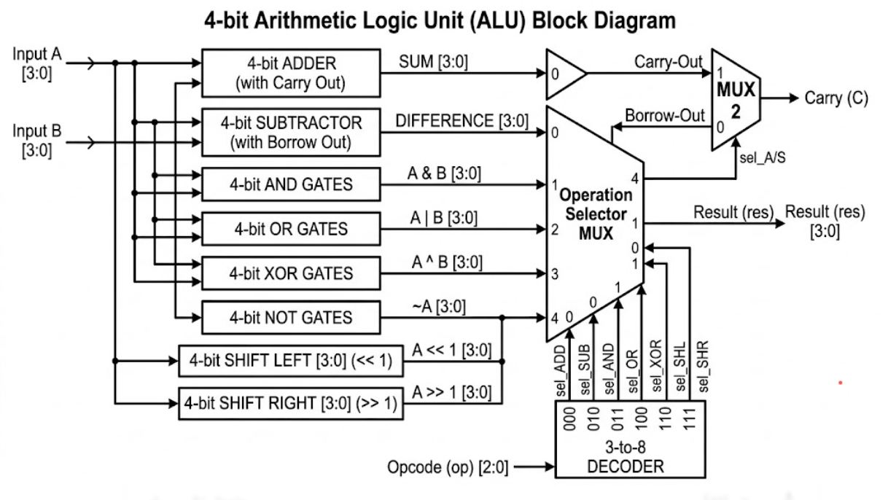

# 4-bit Arithmetic Logic Unit (ALU) Verification 

## Project Overview

This repository contains a high-fidelity **UVM verification environment** for a **4-bit ALU**. The design supports 8 operations, including signed arithmetic, logical bitwise operations, and shifts. A major focus of this project was the verification of **Status Flags (C, Z, N, V)** and ensuring their correct behavior across different operational modes using **SystemVerilog Assertions (SVA)** and **Functional Coverage**.

---

## Design Specifications

* **Word Size:** 4-bit operands ($A, B$) and Result ($res$).
* **Operations:** ADD, SUB, AND, OR, XOR, NOT, SHL, SHR.

**Status Flags:**
* **Carry (C):** Unsigned carry-out/borrow.
* **Zero (Z):** Asserted if the result is 4'b0000.
* **Negative (N):** Reflects the sign bit (MSB) of the result.
* **Overflow (V):** Asserted for signed arithmetic overflows (e.g., Pos + Pos = Neg).

---

## Block Diagram

---

## ALU Operational Truth Table

| Opcode (op)	| Operation	| Result (res)	| Carry (C) |
| :---: | :---: | :---: | :---: |
| 3'b000 | **ADD** | `A + B`    | Active |
| 3'b010 | **SUB** | `A - B`     | Active (Borrow) |
| 3'b011 | **AND** | `A & B`     | 0 |
| 3'b011 | **OR**  | `A or B`    | 0 |
| 3'b100 | **XOR** | `A ^ B`     | 0 |
| 3'b101 | **NOT** | `~ A `      | 0 |
| 3'b110 | **SHL** | `A << 1`   | 0 |
| 3'b111 | **SHR** | `A >> 1`    | 0 |

---

## Key Flag Definitions

* **Zero (Z):** $1$ if res == 4'b0000, else $0$.
* **Negative (N):** $1$ if res[3] == 1 (MSB is high), else $0$.
* **Carry (C):** $1$ if an addition results in a bit-5 carry or a subtraction requires a borrow.
* **Overflow (V):** $1$ if the result exceeds the signed 4-bit range ($-8$ to $+7$).

---

## SystemVerilog Assertions (SVA)

White-box assertions are bound to the RTL to verify timing-critical flag logic:

* **Reset Integrity:** Ensures all outputs and flags are cleared on `rst`.

**Flag Logic:**
 * **Zero/Neg:** Verified using the `<->` (equivalence) operator against the result.
 * **Logic Cleanliness:** Asserts that `carry` and `ovfl` must be 0 during logical operations (AND, OR, etc.).

---

## Functional Coverage

The alu_coverage subscriber ensures high-quality verification closure through:

* **Flag Toggling:** Ensures every flag (C, Z, N, V) has been seen in both 0 and 1 states.
* **Transition Coverage:** Tracks opcode switching (e.g., ADD $\rightarrow$ XOR) to ensure no state-leaking between math and logic modes.

**Cross Coverage:**
* **cross_math_ovfl:** Verifies that overflow was triggered specifically during ADD and SUB.
* **cross_sub_neg:** Ensures negative results were specifically tested during subtraction.
* **Illegal Bins:** Automatically flags if carry or ovfl are asserted during logical operations.

---

## Test Sequences & Stimulus Strategy

The environment utilizes a dual-layered stimulus approach to ensure all arithmetic corner cases are hit:

|     Sequence Name       |    Objective     | Scenario Targeted |
| :---: | :---: | :---: |
| `alu_base_seq`     | **Random Stress**        |  100 iterations of random operands and opcodes to test general functionality.          |
| `alu_directed_seq` |**Corner Case Injection** |Overflow: Drives $7 + 1$ (Positive + Positive = Negative MSB).                          |
|                    |                          |Carry/Borrow       Drives $15 + 1$ (Carry-out) and $10 - 10$ (Zero flag).               |
|                    |                          |Shift Boundaries   Verifies MSB loss in SHL ($8 \ll 1$) and LSB loss in SHR ($1 \gg 1$).|
|                    |                          |Bitwise Integrity  Verifies checkerboard patterns (1010 and 0101) for AND/OR/XOR.       |

---

## Tools Used

* **Language:** SystemVerilog, UVM
* **Simulator:** Aldec Riviera Pro 2025.04 / EDA Playground
* **Methodology:** Constrained Random Verification (CRV), Assertion Based Verification (ABV), Coverage Driven Verification (CDV)
---

## Technical Insight for Recruiters

"Verifying an ALU requires more than just checking the result; it requires verifying the **processor status bits**. My environment uses SVA to ensure that the Negative and Overflow flags behave according to signed 2's complement rules, while coverage ensures that boundary conditions like 'Borrow' in subtraction are fully exercised."