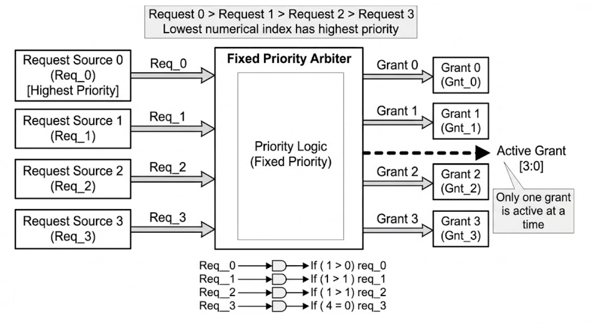

# Fixed-Priority Arbiter UVM Verification Environment

## Project Overview

This repository contains a complete **UVM verification environment** for a **4-channel Fixed-Priority Arbiter**. In this design, access to a shared resource is granted based on a strict static hierarchy where `req[0]` has the highest priority and `req[3]` has the lowest. The environment focuses on validating that the priority encoder logic never violates its ranking and that grants are strictly mutually exclusive.

---

## Design Specifications

* **Channels:** 4 Request/Grant pairs.
* **Priority Ranking:** `req[0]` (Highest) > `req[1]` > `req[2]` > `req[3]` (Lowest).
* **Reset:** Synchronous, active-low (`rst_n`) clears all grants.
* **Protocol:** Single-cycle request-to-grant latency.
---

## Block Diagram

---

## Priority Logic Table

|`req[3:0]`|	`gnt[3:0]`	|Description|
| :---: | :---: | :---: |
|`0000`	|`0000`	|No requests, no grants.|
|`0001`	|`0001`	|Master 0 granted.|
|`1001`	|`0001`	|Master 0 overrides Master 3 (Fixed Priority).|
|`1110`	|`0010`	|Master 1 overrides Masters 2 and 3.|
|`1000`	|`1000`	|Master 3 granted (only because 0, 1, 2 are idle).|

---

## SystemVerilog Assertions (SVA)

The environment uses several high-value assertions to ensure bus safety:

*  **One-Hot Check:** Uses `$onehot0(gnt)` to ensure that the arbiter never grants access to more than one master simultaneously.
* **Ghost Grant Prevention:** Asserts that a grant can only exist if a corresponding request is active (`|gnt |-> |req`).
* **Priority Hierarchy:** Individual assertions (`a_0_check` through `a_3_check`) verify that if a higher-priority request is missing, the next one in line receives the grant.

---

## Functional Coverage

* **Request Combinations:** Tracks all 16 possible request patterns (`4'b0000 to 4'b1111`) to ensure the priority encoder is fully exercised.
* **Grant Distribution:** Uses a specialized coverpoint with `$onehot` filtering to ensure only legal grant states are sampled.
* **Reset Cross:** Cross-covers `rst_n` with `req` to prove that the arbiter was reset during various request loads.

---

## Test Sequences & Stimulus Strategy

I developed targeted sequences to stress-test the arbiter's decision-making logic:

|     Sequence Name       |    Objective     | Scenario Targeted |
| :---: | :---: | :---: |
|`arbiter_directed_sequence`| **Sanity Check**| Walks through every request bit individually (`0001` → `0010` → `0100` → `1000`). This ensures each master can successfully gain bus access when no competition exists.|
|`arbiter_starvation_sequence`| **Starvation Test**| Drives continuous requests on `req[0]` while occasionally asserting `req[3]`. This verifies that the lower-priority agent is correctly blocked (starved) as per the fixed-priority specification.|
|`arbiter_stress_sequence`|**Stress Test**| Uses CRV to drive multi-bit request patterns (e.g., `4'b1101`) to ensure the highest-priority bit is always the only one granted.|
|`arbiter_reset_sequence`|**Reset Injection**| Validates that a mid-operation reset immediately drops all grants, preventing "hanging" bus access.|

---

## Tools Used

* **Language:** SystemVerilog, UVM
* **Simulator:** Aldec Riviera Pro 2025.04 / EDA Playground
* **Methodology:** Constrained Random Verification (CRV), Assertion Based Verification (ABV), Coverage Driven Verification (CDV).

---

## Link to open the project

🚀 **[Run Simulation on EDA Playground](https://www.edaplayground.com/x/ajWH)**

---

## Technical Insight for Recruiters

"Fixed-priority arbiters are the backbone of many interrupt controllers. In this project, I focused on verifying the **Priority Lock**—ensuring that lower-priority requests never 'leak' through when a higher-priority request is present. My **starvation sequence** explicitly validates this behavior, while my **One-Hot SVA** guarantees that the design will never cause bus contention in a real SoC environment."
