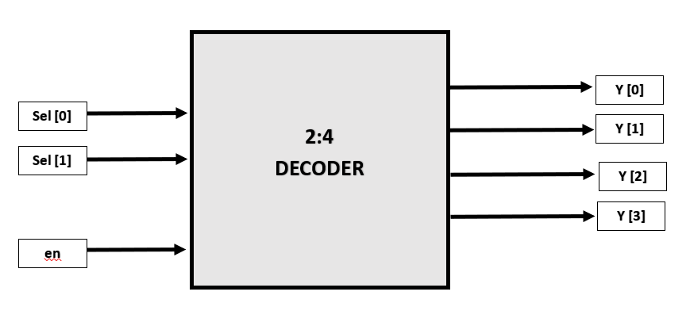

# 2-to-4 Decoder UVM Verification Environment

## Project Overview

This repository contains a comprehensive **UVM-based verification environment** for a **2-to-4 Decoder** with an Enable (`en`) signal. The project demonstrates advanced verification techniques, including **SystemVerilog Assertions (SVA)** bound to RTL, **X-propagation testing**, and transition coverage to ensure 100% functional integrity.

---

## Design Specifications

* **Enable (en):** Active-high. When low, all outputs are forced to `4'b0000`.
* **Select (sel):** 2-bit selection input to choose one of four output lines.
* **Output (y):** 4-bit one-hot output vector.
* **Error Handling:** The RTL is designed to propagate `X` values from the input `sel` to the output `y` when enabled, facilitating early bug detection in the SoC integration phase.

---

## Block Diagram

---

## Truth Table

| Enable (en) |	Select (sel) | Output (y) | Mode |
| :---: | :---: | :---: | :---: | 
| 0	| XX  | 0000  |Disabled        |
| 1	| 00  | 0001  |Active (Port 0) |
| 1	| 01  | 0010  |Active (Port 1) |
| 1	| 10  | 0100  |Active (Port 2) |
| 1	| 11  | 1000  |Active (Port 3) |

---
## Testbench Architecture

The verification environment is built using a layered UVM approach to ensure reusability and modularity.

## Key Components:

* **UVM Agent:** Encapsulates the Sequencer, Driver, and Monitor.
* **Driver:** Drives constrained-random stimulus into the virtual interface.
* **Monitor:** Observes the interface signals and converts them into transaction objects.
* **Scoreboard:** Implements the reference model to compare actual RTL output against expected results.
* **Functional Coverage:** Tracks which input combinations and select transitions have been exercised.
---

## Verification Features

## 1. SystemVerilog Assertions (SVA)

White-box assertions monitor the interface to catch protocol violations immediately:

* **One-Hot Integrity:** Uses `$onehot(y)` to guarantee that no more than one bit is ever high.
* **Functional Correctness:** Verifies that $Y$ matches $(4'b0001 \ll sel)$ whenever en is active.
* **X-Propagation:** Asserts that an unknown value on `sel` must result in an unknown state on `y`, preventing hidden logic errors.
* **Glitch Detection:** Uses `$stable` to ensure the output does not change unless an input `(en or sel)` changes.

## 2. Functional Coverage

The UVM Subscriber implements a detailed covergroup to track verification progress:

* **Transition Bins:** Tracked for `sel` (e.g., `0 => 1, 1 => 2`) to ensure all switching paths are exercised.
* **Cross Coverage:** The `cross` of `en` and `sel` confirms that every selection was tested in both enabled and disabled states.
* **Illegal Bins:** Defined for `multi_bit` high scenarios to automatically flag non-one-hot behavior in the coverage report.

---

## Test Sequences & Stimulus Strategy

The environment utilizes specialized sequences to stress-test the combinational logic and control signals:

|     Sequence Name       |    Objective     | Scenario Targeted |
| :---: | :---: | :---: |
| `dec_base_seq`	   | **Random Stress**	    |50 iterations of constrained-random stimulus for general logic verification.      |
| `dec_en_zero_seq`	   | **Safety Check**	    |Ensures all outputs remain 4'b0000 when en is low, regardless of sel.             |
| `dec_walking_ones`   | **Port Sweep**	        |Linearly sweeps through all select values (0 to 3) to verify each output path.    |
| `dec_x_prop_seq`	   | **Error Injection**	|Manually forces 2'bxx on sel to verify that the RTL correctly propagates unknowns.|
| `dec_sel_toggle_seq` | **State Stability**	|Drives a specific transition path (e.g., 0-1-2-3) to verify stable switching.     |
| `dec_en_toggle_seq`  | **Control Stress**	    |Rapidly toggles the Enable signal to verify transient behavior.                   |

---

## Tools Used

* **Language:** SystemVerilog, UVM
* **Simulator:** Aldec Riviera Pro 2025.04 / EDA Playground
* **Methodology:** Constrained Random Verification (CRV), Assertion Based Verification (ABV), Coverage Driven Verification (CDV)

---

## Technical Insight for Recruiters

"This verification environment goes beyond simple functional checks. By implementing **X-propagation sequences** and **stability assertions**, the testbench ensures that the decoder behaves predictably in real-world SoC environments where 'X' values and glitches are common integration challenges."