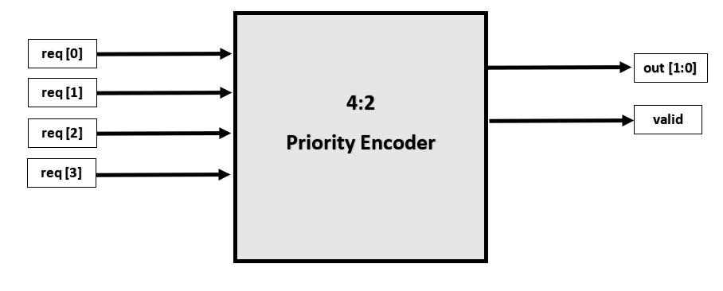

# 4-to-2 Priority Encoder UVM Verification Environment

## Project Overview

This repository contains a robust **UVM (Universal Verification Methodology)** environment designed to verify a **4-to-2 Priority Encoder**. The verification focuses on ensuring that the highest-order active request bit correctly dictates the output code and that the valid signal accurately reflects the input state.

---

## Design Specifications
* **Inputs:** 4-bit request vector (`req[3:0]`).
* **Outputs:** 2-bit encoded value (`out[1:0]`) and a `valid` bit.
* **Priority Rule:** `req[3]` has the highest priority, followed by `req[2]`, `req[1]`, and `req[0]`.

---

## Block Diagram

---

### Truth Table

| req[3] | req[2] | req[1] | req[0] | out[1:0] | valid |
| :---: | :---: | :---: | :---: | :---: | :---: |
| 1 | X | X | X | 11 | 1 |
| 0 | 1 | X | X | 10 | 1 |
| 0 | 0 | 1 | X | 01 | 1 |
| 0 | 0 | 0 | 1 | 00 | 1 |
| 0 | 0 | 0 | 0 | XX | 0 |

---

## System Verilog Assertions (SVA)

White-box verification ensures combinational logic integrity and protocol compliance:

* **Priority Validation:** Ensures that if `req[3]` is high, the `code` is strictly `2'b11`, regardless of other inputs.
* **Valid Bit Protocol:** Asserts that `valid` must be high if any request is active and low if all are zero.
* **Invalid State Safety:** Ensures that when `valid` is low, the `code` output remains at a safe `2'b00`.

---

## Functional Coverage

A dedicated UVM Subscriber tracks high-quality coverage metrics to ensure verification closure:

* **Toggle Coverage:** Tracks `0 -> 1` and `1 -> 0` transitions for every bit of the request bus.
* **Cross Coverage (`cross_priority`):** Monitors the relationship between `req` and `code`.
* **Intelligent Binning:** Uses `ignore_bins` to exclude logically impossible combinations (e.g., `req[3]` active but `code` being anything other than `3`), ensuring realistic and accurate coverage reporting.

---

## Test Sequences & Stimulus Strategy

To ensure the priority arbitration logic and valid bit signaling are robust, the following sequences were implemented:

|    Sequence Name      |    Objective    |  Scenario Targeted  |
| :---: | :---: | :---: |
| `p_enc_base_seq`	    | **One-Hot Verification**	|Iterates through `4'b0001` to `4'b1000` to verify basic encoding paths without overlapping bits.       |
| `p_enc_conflict_seq`	| **Priority Arbitration**	|Drives `4'b1111` to ensure the priority logic correctly masks all lower-order bits and outputs `2'b11`.|
| `p_enc_all_zeros_seq`	| **Idle/Reset State**	    |Drives `4'b0000` to verify the valid bit drops to `0` and the output stays in a safe state.            |
| `p_enc_random_seq`	| **Stress Testing**	    |100 iterations of constrained-random vectors to explore every possible overlapping bit combination.    |

---

## Tools Used

* **Language:** SystemVerilog, UVM
* **Simulator:** Aldec Riviera Pro 2025.04 / EDA Playground
* **Methodology:** Constrained Random Verification (CRV), Assertion Based Verification (ABV), Coverage Driven Verification (CDV)

---

## Link to open the Project

🚀 **[Run Simulation on EDA Playground](https://www.edaplayground.com/x/E2NY)**