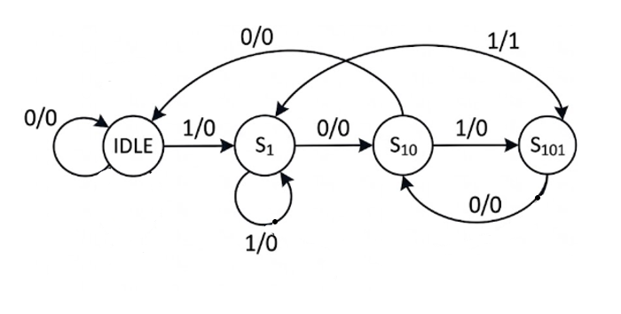

# Mealy FSM: 1011 Overlapping Sequence Detector

## Project Overview

This repository contains a **Mealy Finite State Machine (FSM)** optimized for the detection of the binary sequence **"1011"**. Unlike a Moore machine, this implementation detects the pattern a clock cycle earlier by making the output a combinational function of the input. This design supports **overlapping detection**, meaning the last bit of a successful sequence can serve as the first bit of the subsequent sequence.

---

## Design Specifications

* **Detection Pattern:** `1011`
* **Type:** Mealy Machine (Output depends on `current_state` AND `bit_in`).
* **Overlapping:** Supported (e.g., `1011011` is detected twice).
* **Efficiency:** Requires only 4 states (`IDLE`, `S1`, `S10`, `S101`) whereas a Moore machine would require 5.

---

## State Diagram

---

## State Transition Table

|Current State |Input (bit_in) |Next State |Output (pattern_found) |Sequence Status|
| :---: | :---: | :---: | :---: | :---: |
|IDLE  |0 |IDLE |0  |Waiting for first '1'                             |
|IDLE  |1 |S1   |0  |Found '1'                                         |
|S1    |0 |S10  |0  |Found '10'                                        |
|S1    |1 |S1   |0  |Found '11' (Last '1' starts new seq)              |
|S10   |0 |IDLE |0  |Sequence broken (100)                             |
|S10   |1 |S101 |0  |Found '101'                                       |
|S101  |0 |S10  |0  |Sequence broken (1010), but '10' is a valid prefix|
|S101  |1 |S1   |1  |Pattern Found (1011)! Overlap starts at '1'       |

---

## Key Verification Insights from this Table

* **The "Mealy Hit":** Look at the last row. When the state is `S101` and the input is `1`, the output `pattern_found` goes high immediately in the same clock cycle.
* **Overlap Logic:** Notice that from `S101`, if the input is `1`, we go back to `S1` instead of `IDLE`. This is because that fourth bit (the '1' that completed the 1011) could also be the first bit of the *next* 1011 sequence.
* **The "1010" Recovery:** In the `S101` row, if we receive a `0`, we don't go to `IDLE`. We go to `S10` because the last two bits "10" are still a valid part of a potential new sequence.

---

## SystemVerilog Assertions (SVA)

Mealy machines are prone to false positives. I wrote targeted assertions to prevent this:

* **Mealy Output Check:** `p_out_state_check` verifies that `pattern_found` is high immediately when `bit_in` hits '1' in state `S101`.
* **Anti-False Positive:** `p_no_false_out` ensures the output stays low in every other state/input combination, which is the most common bug in Mealy designs.
* **Recovery Logic:** `a_s101_to_s10` proves that if the sequence is broken (e.g., `101 + 0`), the FSM correctly falls back to `S10` to look for the next `1`.

---

## Functional Coverage

* **Golden Path:** Tracks the full transition sequence `IDLE -> S1 -> S10 -> S101 -> S1`.
* **Mealy Hit Cross:** A 3-way cross between `state`, `bit_in`, and `pattern_found` to prove the detector was exercised in the exact cycle the combinational logic was valid.
* **Transition Bins:** Explicitly covers reset transitions from every state to IDLE using bins `s_xx_to_idle`.

---

## Test Sequences & Stimulus Strategy

To prove the robustness of the overlapping logic, I implemented specific sequence scenarios:

|     Sequence Name       |    Objective     | Scenario Targeted |
| :---: | :---: | :---: |
|`fsm_overlap_seq`|**Stress Test** |Specifically drives a continuous stream like 1011011 to ensure the FSM doesn't miss the second pattern while transitioning from the first.|
|`fsm_reset_seq`|**Reset Injection**  |Injects a reset during the S10 state to ensure no "residual state" affects the next detection attempt.|
|`fsm_random_sequence`|**Random Test**|Uses dist constraints to ensure a healthy mix of 0s and 1s, preventing the FSM from getting "stuck" in a single state during random testing.|

---
## Tools Used

* **Language:** SystemVerilog, UVM
* **Simulator:** Aldec Riviera Pro 2025.04 / EDA Playground
* **Methodology:** Constrained Random Verification (CRV), Assertion Based Verification (ABV), Coverage Driven Verification (CDV)

---

## Link to open the Project

🚀 **[Run Simulation on EDA Playground](https://www.edaplayground.com/x/E39a)**

---

## Technical Insight for Recruiters

"A Mealy FSM is more hardware-efficient but harder to verify because the output path is combinational. My verification environment specifically addresses this by using **immediate assertions** and **cross-coverage** to ensure `pattern_found` only triggers under the exact state/input conditions, while correctly handling overlapping patterns to maximize throughput."

