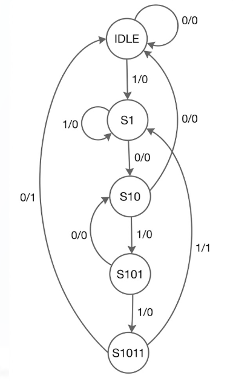

# Moore FSM: 1011 Sequence Detector (Non-Overlapping)

## Project Overview

This repository features a **Moore Finite State Machine (FSM)** designed to detect the binary sequence **"1011"**. As a Moore machine, the output is synchronized with the state, ensuring a glitch-free `pattern_found` signal. The verification environment uses **UVM** to validate state transitions, reset recovery, and sequence detection accuracy using **SystemVerilog Assertions (SVA)** and **Functional Coverage**.

---

## Design Specifications

* **Detection Pattern:** 1011
* **Type:** Moore Machine (Output depends only on current state).
* **Overlapping:** Non-overlapping (After detection, it resets to `IDLE` or starts fresh).

**States:**
* **IDLE:** Waiting for first '1'.
* **S1:** Detected '1'.
* **S10:** Detected '10'.
* **S101:** Detected '101'.
* **S1011:** Detected '1011' (**Pattern Found**).

---

## State Diagram

---

## State Transition Table
|Current State |bit_in = 0 | bit_in = 1| Output (pf)|
| :---: | :---: | :---: | :---: |
|**IDLE**	|IDLE	|S1	    |0|
|**S1**	    |S10	|S1	    |0|
|**S10**	|IDLE	|S101	|0|
|**S101**	|S10	|S1011	|0|
|**S1011**	|IDLE	|S1  	|1|

---

## SystemVerilog Assertions (SVA)

I used a "White-Box" testing approach by binding assertions to the internal current_state of the DUT:

* **Transition Accuracy:** Individual assertions (like `a_s10_to_s101`) verify that the FSM moves to the correct next state based on `bit_in`.
* **Moore Output Logic:** Ensures `pattern_found` is only high when the state is exactly `S1011`.
* **Reset Integrity:** Validates that the FSM initializes to `IDLE` upon reset release (`$rose(rst_n)`).

---

## Functional Coverage

The environment achieves verification closure through:

* **State Coverage:** Ensures every state (`IDLE` through `S1011`) is visited.
* **Transition Coverage:** Tracks specific arcs like `S1011 -> IDLE` and `S1 -> S10`.
* **Illegal Transitions:** Uses `illegal_bins` to automatically trigger a failure if the FSM "jumps" states (e.g., `IDLE` directly to `S10`).
* **Sequence Toggle:** A custom coverpoint tracks the actual bit sequence (`1 => 0 => 1 => 1`) to ensure the pattern was seen by the coverage collector.

---

## Test Sequences & Stimulus Strategy

|     Sequence Name       |    Objective     | Scenario Targeted |
| :---: | :---: | :---: |
|`fsm_random_sequence`| **Stress Test**      | 50 cycles of constrained-random `bit_in` stimulus to stress-test unplanned sequence fragments.|
|`fsm_directed_seq`   |**Directed Test**     | Manually drives the `1011` sequence to confirm functional success.|
|                     |**Reset Injection**   | Injects an active-low `rst_n` mid-sequence to verify the FSM gracefully returns to `IDLE`.|

---

## Tools Used

* **Language:** SystemVerilog, UVM
* **Simulator:** Aldec Riviera Pro 2025.04 / EDA Playground
* **Methodology:** Constrained Random Verification (CRV), Assertion Based Verification (ABV), Coverage Driven Verification (CDV)

---

## Technical Insight for Recruiters

"Verifying an FSM requires checking both the `legal` and `illegal` paths. My environment uses illegal_bins in the coverage model to detect 'state jumping' and SVA to ensure the Moore output is strictly state-dependent. I also included `recovery` assertions to prove the FSM can restart pattern detection correctly if a sequence is broken halfway (e.g., 10-0)."