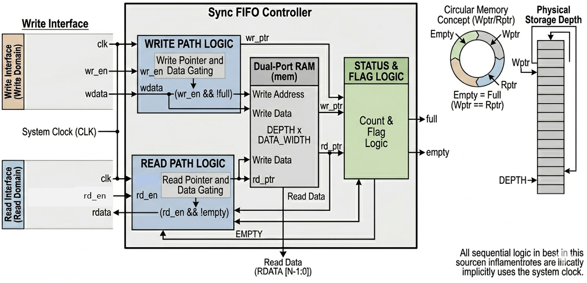

# Synchronous FIFO UVM Verification Environment

## Project Overview

This repository contains a robust **UVM-based verification** environment for a **Synchronous FIFO**. The design features a parameterized depth and data width, utilizing a pointer-based circular buffer and a dedicated counter for status flag generation. The environment is designed to stress-test the boundary conditions where hardware failures are most common.

---

## Design Specification

* **Depth:** 16 (Parameterized)
* **Data Width:** 8-bit (Parameterized)
* **Write Port:** Synchronous with `wr_en` and `wdata`.
* **Read Port:** Synchronous with `rd_en` and `rdata`.
* **Status Flags:** `full` (High when count = 16), `empty` (High when count = 0).

---

## Block Diagram

---

## SystemVerilog Assertions (SVA)

To ensure the RTL behaves correctly at the protocol level, I used targeted assertions:

* **Overflow/Underflow Protection:** `a_no_ovfl` and `a_no_underflow` ensure that no write or read occurs when the respective status flags are high.
* **Flag Mutual Exclusion:** `a_mutex_flag` proves that the FIFO can never be `full` and `empty` at the same time—a fundamental logic requirement.
* **Reset Check:** `a_reset_chk` validates that the FIFO immediately clears its pointers and settles into the `empty` state upon reset.

---

## Functional Coverage

**Depth Transitions:** Tracks the movement from `Empty -> Full` and `Full -> Empty `using transition bins.

**Cross-Coverage:**
* **cross_write_when_full:** Proves the testbench attempted to write into a full FIFO.
* **cross_empty_rd:** Proves the testbench attempted to read from an empty FIFO.
* **cross_simultaneous:** Confirms that concurrent Read/Write operations were verified.

**Data Range Coverage:** Uses bins to ensure that `zeros`, `ones`, and various numerical ranges were passed through the memory to check for bit-stuck errors.

---

## Test Sequences & Stimulus Strategy

I implemented a multi-stage stimulus strategy to ensure 100% functional coverage of the FIFO state machine:

| Sequence Name        | Objective           | Scenario Targeted |
| :---: | :---: | :---: |
|`fifo_ovfl_unfl_seq`|**Overflow & Underflow Test**| Forces the FIFO into **Overflow** and **Underflow** conditions. It attempts to write and read 30 times each into a 16-deep FIFO to verify that the internal `wr_ptr`, `rd_ptr` and `mem` are protected by the `full`and `empty` flag repectively.|
|`fifo_simultaneous_seq`|**Simultaneous WR & RD Test**|Drives `wr_en` and `rd_en` high in the same clock cycle. This is a critical test for the `count` logic to ensure it remains stable when data is entering and leaving at the same rate.|
|`fifo_threshold_seq`|**OFF-by-One Test**|Specifically targets the **"Almost Full"** and **"Almost Empty"** boundaries. This ensures there are no "off-by-one" errors in the flag generation logic.|
|`fifo_directed_sequence`|**Directed Test**|Handles initial bring-up and a specific "Reset while Full" scenario to ensure pointers return to zero regardless of previous state.|
| `fifo_random_seq` |**Random Stress Test**|To verify the FIFO’s robustness under unpredictable traffic patterns and to ensure the internal logic (pointers and counter) recovers correctly from asynchronous-like reset events.|

---

## Tools Used

* **Language:** SystemVerilog, UVM
* **Simulator:** Aldec Riviera Pro 2025.04 / EDA Playground
* **Methodology:** Constrained Random Verification (CRV), Assertion Based Verification (ABV), Coverage Driven Verification (CDV) 

---

## Link to open the Project

🚀 **[Run Simulation on EDA Playground](https://www.edaplayground.com/x/AJqq)**

---

## Technical Insight for Recruiters

"Verifying a Synchronous FIFO requires more than just checking if data goes in and out. In this project, I focused on **Boundary Protection**. My environment uses **SVA** to catch overflow/underflow attempts instantly and **cross-coverage** to guarantee that the hardware's status flags were exercised under extreme conditions, such as simultaneous R/W at the threshold of being full."