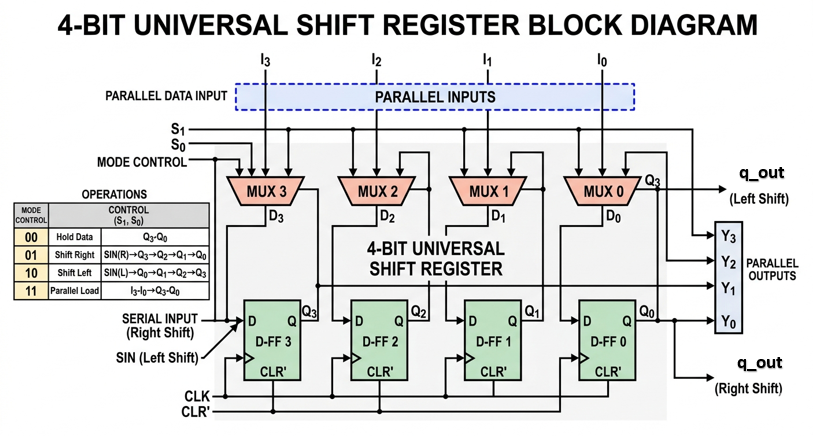

# 4-bit Universal Shift Register (USR) UVM Verification Environment

## Project Overview

This repository contains a robust **UVM verification environment** for a **4-bit Universal Shift Register**. The design is a highly versatile sequential component capable of four distinct modes: Hold, Shift Right, Shift Left, and Parallel Load. The verification strategy ensures data integrity during high-speed shifts and validates the control logic for seamless mode switching.

---

## Design Specifications

**Word Size:** 4-bit Data.
**Operating Modes (`mode`):**
* `00`: Hold (Maintain current state).
* `01`: Shift Right (Serial data enters at MSB).
* `10`: Shift Left (Serial data enters at LSB).
* `11`: Parallel Load (PIPO - Parallel-In Parallel-Out).
**Reset:** Synchronous reset to 4'b0000.

---
## Block Diagram

---

## Functional Logic Table

| Mode (2'b)	| Operation	| Logic Description |
| :---: | :---: | :---: |
|`00`   | **Hold**           |Q_out = Q_out        |
|`01`   | **Shift Right**    |Q_out = {sin_left, Q[3:1]} |
|`10`   | **Shift Left**     |Q_out = {Q[2:0], sin_right}|
|`11`   | **Parallel Load**  |Q_out = d_in               |

---

## Testbench Architecture

The verification environment is built using a layered UVM approach to ensure reusability and modularity.

## Key Components:

* **UVM Agent:** Encapsulates the Sequencer, Driver, and Monitor.
* **Driver:** Drives constrained-random stimulus into the virtual interface.
* **Monitor:** Observes the interface signals and converts them into transaction objects.
* **Scoreboard:** Implements the reference model to compare actual RTL output against expected results.
* **Functional Coverage:** Tracks which input combinations and select transitions have been exercised.
---

## SystemVerilog Assertions (SVA)

White-box assertions are bound to the RTL to ensure cycle-accurate data movement:

* **Shift Integrity:** Compares the current `q_out` against a concatenated version of `$past(q_out)` and the serial input.
* * Example (Shift Right): `q_out[2:0] == $past(q_out[3:1])`.
* **Parallelism:** Asserts that in mode `11`, the output matches the input data exactly one clock cycle later.
* **Hold Logic:** Ensures that if the mode is `00`, the data remains absolutely stable.

---

## Functional Coverage

The environment tracks comprehensive coverage to reach 100% sign-off:

* **Transition Bins:** Captures mode changes like `Shift Left -> Shift Right` and `Parallel Load -> Hold`.
* **Wildcard Bins:** Implements "Walking Ones" coverage to ensure every bit in the 4-bit register is capable of holding a `'1'`.
* **Cross Coverage:** Crosses `mode` with `rst` to prove that the register was reset during every possible operating state.

---

## Test Sequences & Stimulus Strategy

Implemented a tiered stimulus approach to verify both structural paths and random operational stress:

|     Sequence Name       |    Objective     | Scenario Targeted |
| :---: | :---: | :---: |
|`univ_sr_directed`	|**SIPO/PIPO Verification**	|Fills the register serially from both ends and verifies parallel loads.|
|`univ_sr_stress`	|**Mode Switching**	        |Rapidly switches between Shift Left and Shift Right to verify data bit-steering.|
|`univ_sr_random`	|**CRV Stress Test**	    |100 iterations of random modes with a 10% reset distribution to catch edge cases.|
|`univ_sr_reset`	|**Asynchronous behavior**	|Verifies that a reset pulse correctly clears the data regardless of the current mode.|

---

## Tools Used

* **Language:** SystemVerilog, UVM
* **Simulator:** Aldec Riviera Pro 2025.04 / EDA Playground
* **Methodology:** Constrained Random Verification (CRV), Assertion Based Verification (ABV), Coverage Driven Verification (CDV)

---

## Link to open the Project

🚀 **[Run Simulation on EDA Playground](https://www.edaplayground.com/x/eKq9)**

---

## Technical Insight for Recruiters

"A Universal Shift Register is a fundamental block in Serial-to-Parallel converters. Verifying it requires strict checking of bit-indices during shifts. My environment uses **concatenation-based assertions** to ensure that not a single bit is lost or misplaced during bidirectional operations, and my **transition coverage** ensures that the 'Hold' and 'Load' modes work correctly even under rapid mode-switching stress."